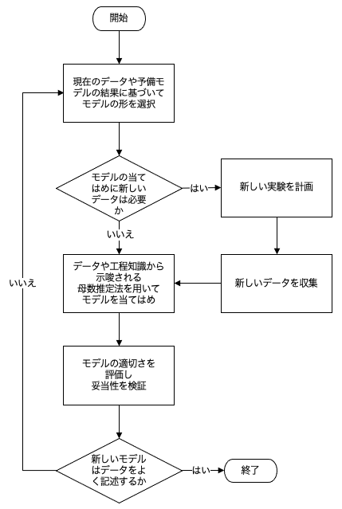

[原文 (Original English)](https://www.itl.nist.gov/div898/handbook/pmd/section4/pmd41.htm)  
閲覧(UTC)：2026-07-21 12:15:47  
[⬅️](pmd4.md)[➡️](pmd42.md)  

4. [工程のモデル化](../pmd.md)  
4.4. [工程モデル化のためのデータ分析](pmd4.md)  

---

# 4.4.1. 効果的な工程モデルを構築するための基本的な手順

#### 普遍的な枠組みを提供する基本的手順
モデル構築に用いられる基本的な手順は、あらゆるモデル化手法において共通している。
詳細については手法ごとに多少の違いがあるが、共通の手順を理解し、分析に必要な典型的な[前提条件](../section2/pmd2.md)と組み合わせることで、ほぼすべての手法による結果を解釈し、理解するための枠組みが得られる。

#### モデル構築の基本的手順
モデル構築過程の基本的な手順は以下の通り。

1. モデルの選択
2. モデルの適合
3. モデルの検証

これら3つの基本手順をデータに適したモデルが構築されるまで反復的に用いる。
モデル選択の段階では、データのプロット、工程に関する知識、工程に関する仮定を用いて、データに適合させるモデルの形式を決定する。
そして、選択されたモデルと場合によってはデータに関する情報を用いて、適切なモデル適合手法を適用し、モデル内の未知の母数を推定する。
母数を推定した後、モデルを慎重に評価し、分析の根底にある仮定が妥当であるかどうかを確認する。
仮定が妥当であると判断されれば、そのモデルを用いて、モデル化のきっかけとなった科学的もしくは工学的課題に対する答えを得ることができる。
しかし、モデルの妥当性検証によって現在のモデルに問題が特定された場合は、モデル妥当性検証の段階で得られた情報を用いて、改良されたモデルを選択および／または適合させるために、モデル化過程を繰り返す。

#### 基本ステップの変種
上記の段落で説明した工程モデル化の3つの基本手順は、データがすでに収集されており、同じデータ集合をすべてのモデル候補の当てはめに使用できることを想定している。
モデル構築の場面ではこれがよくある事例であるが、初期データに適合させたモデルに基づいて新たに仮説を立てたモデルを適合させるために新しいデータが必要になる場合、基本的なモデル構築手順の1つの変種となる。
この場合、モデル選択とモデル適合の間の基本手順に、「実験計画法](../section3/pmd3.md)とデータ収集という2つの追加手順を加える。
以下のフローチャートは、関連するデータ収集手順をモデル構築過程に組み込んだ、基本的なモデル適合の手順を示している。

#### モデル構築の手順

実際の応用におけるモデル構築手順を示す例は、[4.6節](../section6/pmd6.md)の事例研究に見ることができる。
基本的なモデル構築手順で使用される具体的なツールと手法は、本節の残りの部分で説明する。

#### 初期実験の設計
もちろん、初期データを収集する前に、モデルの選択や適合について検討しておくことも良い考えである。
データが手元にない段階では、初期モデルはどうあるべきかを推測するために、データがどのようになるかの仮説が必要である。
実験の結果について仮説を立てることは、もちろん常に可能というわけではないが、プロジェクトの初期段階での取組みでモデル構築過程全体の効率が最大化され、その工程にとって最適なモデルが得られることがよくある。
実験計画法に関する詳細は、[4.3節](../section3/pmd3.md)および[5章 工程の改善](../../ch5_pri/pri.md)に記載されている。
 
---
#### 訳註
* ページ中の図は翻訳をしております。
