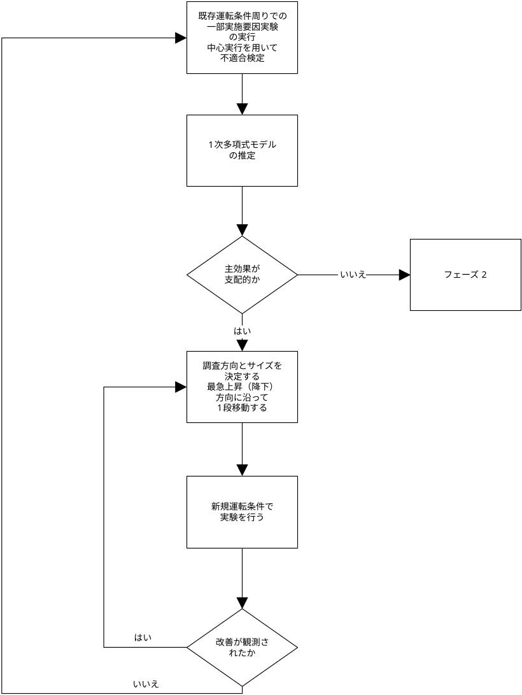

[原文 (Original English)](https://www.itl.nist.gov/div898/handbook/pri/section5/pri5311.htm)  
閲覧(UTC)：2026-08-09 15:53:01  
[⬅️](pri531.md)[➡️](pri5312.md)  

5. [工程の改善](../pri.md)  
5.5. [応用題目](pri5.md)  
5.5.3. [工程最適化方法](pri53.md)  
5.5.3.1. [単応答の場合](pri531.md)  

---

# 5.5.3.1.1. 単応答：最急上昇経路

#### 現在の運転条件を起点とした線形モデルの適合
もし、十分に理解されていない新しい生産工程において初期の実験を行う場合、初期の運転条件である *X*<sub>1</sub>, *X*<sub>2</sub>, ..., *X*<sub>*k*</sub> は、対象応答 *Y* に対して各因子が最大値または最小値を達成する領域から遠く離れた位置にある可能性が高い。
初期運転条件に近く、工程が曲率を示す領域から離れた小さな領域においては、1次モデルが優れた局所近似として機能する。
したがって、次式形式の単純な 1次（もしくは線形多項式）モデルを適合させることは理にかなっている。

$$\hat{Y} = \beta_0 + \beta_1 X_1 + \beta_2 X_2 +\cdots + \beta_k X_k$$

この種のモデルを適合させる実験戦略は前述の通りである。
通常、既存運転条件に置いて繰り返し実行を含む 2<sup>k-p</sup> の一部実施要因実験が実施される（これは直交コード化された因子の座標原点として機能する）。

#### 最大勾配方向を特定、改善が見られなくなるまで実験継続、この過程の繰り返し
「第1 フェーズ」の考え方は、応答にそれ以上の改善が見られなくなるまで、最急上昇（または必要に応じて下降）方向に沿って実験を続ける。
その時点で、新しい探索方向を決定するために、中心実行を含む新しい一部実施要因実験を実施する。
この過程は、ある時点で $`\hat{Y}`$ に有意な曲率が検出されるまで繰り返す。
これは、操作条件 *X*<sub>1</sub>, *X*<sub>2</sub>, ..., *X*<sub>*k*</sub> が、*Y* の最大値（または必要に応じて最小値）が発生する地点近傍にあることを意味する。
有意な曲率、あるいは不適合が検出された場合、実験者は「第2 フェーズ」に進むべきである。
図5.2 は、2因子（すなわち*k* = 2）問題において、曲率が存在する領域を探す線探索の一連の流れを示している。


{: .text-center}
 
**図5.2：2因子最適化問題における線形探索の流れ** 

#### 主な決定事項2つ：探索方向とステップ長
第1 フェーズにおいて、技術者が下すべき主な決定事項は2つある。

1. 探索方向の決定
2. 既存運転条件から移動するステップの長さの決定

図5.3 は、第1 フェーズで求められるさまざまな反復作業のフロー図を示している。
この図は指針として意図されたものであり、実験者が最適化過程に一切関与できないような形で自動化すべきではない。

#### 反復探索過程のフローチャート

{: .text-center}

**図5.3：実験最適化手順第フェーズ・フローチャート**
{: .text-center}

#### 適合モデルの勾配で決定する最大勾配方向
（[上記](pri5311.md#First order)のような）1次モデルが適合され、有用な近似結果が得られたとする。
（純粋な 2次曲率や相互作用に起因する）適合誤差が、主効果に比べて極めて小さい限り、最急上昇法を試みる。
改善効果最大方向を決定するために、以下を用いる。

1. 目的が <u>*Y*の最大化</u>である場合は $`\hat{Y}`$ の勾配によって与えられる最上昇方向の推定値
2. 目的が <u>*Y*の最小化</u>である場合は $`\hat{Y}`$ の負の勾配によって与えられる最急降下方向の推定値

#### 尺度規約によって異なる最大勾配方向 - 等分散尺度を推奨
勾配 $`\mathbf{g}`$ の方向は、係数推定値、すなわち、$`\mathbf{g' = b_1, b_2, \ldots, b_k}`$ によって決まる。
係数推定値 $`\mathbf{b_1, b_2, \ldots, b_k}`$ は、因子の尺度規約に依存し、最急上昇（最急下降）方向も尺度規約に依存する。
つまり、異なる尺度規約を用いる 2人の実験者は工程改善のために異なる経路を辿ることになる。
これは、係数推定値の符号によって与えられる探索領域は、尺度によって変化しないことから、この手法の一般的な有効性を損なうものではない。
ただし、等分散尺度規約を採用することが推奨される。
符号化された因子 *x*<sub>*i*</sub> は、元測定単位での因子 *X*<sub>*i*</sub> に関して、以下の関係式から得られる。

$$x_i = \frac{X_i -\left( X_{\text{low}} + X_{\text{high}} \right)/2}{\left( X_{\text{high}} - X_{\text{low}} \right)/2} \qquad i = 1, 2, \dots , k$$

この符号付け規則は、尺度に依存しない係数推定値を提供し、一般により信頼性の高い探索方向を与えるために推奨される。
原点から距離 *ρ* 離れた位置にある、最急上昇方向における因子設定の座標は次式で与えられる。

$$
\begin{aligned}
\text{maximize} \qquad &  \beta_{0} + \beta_{1}x_{1} + \beta_{2}x_{2} + \cdots + \beta_{k}x_{k} \\
\text{subject to:} \qquad & \sum_{i=1}^{k}{x_{i}^{2}} \le \rho^{2}
\end{aligned}
$$

#### 簡単な方程式が解決策
この問題は、最適化ソルバーの助けを借りて解決できる（例えば、スプレッドシートのソルバー機能など）。
しかし、この場合、解は座標を導き出す次式の単純な方程式であるため、実際には必要ない。

$$x_i^{\*} = \rho \frac{\beta_i}{\sqrt{\sum_{j=1}^k {\beta_j^{2}}}} \qquad i = 1, 2, \ldots ,k$$

#### *ρ* 値の増加を計算する式
技術者は、*ρ* のさまざまな増加値についてこの式を計算し、すべて最急上昇方向上で、異なる係数の設定を得られる。

この方程式の詳細説明は、[技術付録 5A](https://www.itl.nist.gov/div898/handbook/pri/section5/pri5311.md#技術付録5A)を参照のこと。

**例：化学工程の最適化**

#### 探索による最適化の例
（おそらく因子選別実験を経て）次のように結論づけられた。
ある化学工程の収率（*Y* ％）は、主に温度（ *X*<sub>1</sub> ℃）および反応時間（ *X*<sub>2</sub> 分）の影響を受ける。
安全上の理由から、操作範囲は以下である。

$$\begin{aligned}
  50 ≤ & X_1 & ≤ 250\\
 150 ≤ & X_2 & ≤ 500
\end{aligned}$$

#### 因子の水準
この工程は現在、温度 200℃、反応時間 200分で実施されている。
ある工程技術者は、以下の因子水準で、2<sup>2</sup> 完全実施要因実験で行うことを決めた。 
   
| factor | low | center | high |  
| :---: | :---: | :---: | :---: |  
| --- | | | |  
| X<sub>1</sub> | 170 | 200 | 230 |  
| X<sub>2</sub> | 150 | 200 | 250 |  
{: .text-center}

#### 直交符号化された因子
不適合を評価するために、中心水準で5回の反復実行が行われる。
直交符号化された因子は以下の通り。

$$x_1 = \frac{X_1 - 200}{30} \qquad \qquad \text{および} \qquad \qquad x_2 = \frac{X_2 - 200}{50}$$

#### 実験結果
実験結果は以下の通りであった。

| x<sub>1</sub> | x<sub>2</sub> | X<sub>1</sub> | X<sub>2</sub> | Y (= 収率) |  
| :---: | :---: | :---: | :---: | :---: |  
| -1 | -1 | 170 | 150 | 32.79 |  
| +1 | -1 | 230 | 150 | 24.07 |  
| -1 | +1 | 170 | 250 | 48.94 |  
| +1 | +1 | 230 | 250 | 52.49 |  
| 0 | 0 | 200 | 200 | 38.89 |  
| 0 | 0 | 200 | 200 | 48.29 |  
| 0 | 0 | 200 | 200 | 29.68 |  
| 0 | 0 | 200 | 200 | 46.50 |  
| 0 | 0 | 200 | 200 | 44.15 |  
{: .grid-table}
 
（読者は、このデータを[テキスト](https://www.itl.nist.gov/div898/handbook/datasets/IMPROVE-5_5_3_1_1.DAT)ファイルとしてダウンロードできる。）

#### 分散分析（ANOVA）の表
1次多項式モデルに対応する ANOVA表は次の通り。

```
                 SUM OF        MEAN    F
SOURCE          SQUARES   DF  SQUARE  VALUE  PROB>F
MODEL          503.3035   2  251.6517 4.7972 0.0687
CURVATURE        8.2733   1    8.2733 0.1577 0.7077
RESIDUAL       262.2893   5   52.4579
  LACK OF FIT   37.6382   1   37.6382 0.6702 0.4590
  PURE ERROR   224.6511   4   56.1628

COR TOTAL      773.8660   8
```

#### 得られたモデル
ANOVA表から、交互作用項による線形近似の不適合は有意ではなく、曲率の証拠も認められないことが判る。
さらに、1次モデルが有意であるという証拠が認められる。
その結果得られたモデル（符号化変数による）は次式となる。

$$\hat{Y} = 40.644 - 1.2925 x_1 + 11.14 x_2$$

#### 診断確認
通常の診断確認では、回帰の仮定を満たしていることが確認されたが、R<sup>2</sup> 値はそれほど高くはなく、R<sup>2</sup> = 0.6504 である。

#### 次実行の各要因水準を決定する最急上昇方向の利用
$`\hat{Y}`$ を<u>最大化</u>するために最急上昇方向を用いる。
技術者は、原点から（符号化された単位で）1単位離れた、最急上昇方向上の点が望まれるため *ρ* = 1 を選択した。
故に、予測された *Y* 応答の上記式から、次の実行における因子水準の座標は次式で与えられる。

$$\begin{array}{lcl}
x_1^* & = & \frac{\rho\beta_1}{\sqrt{\sum_{j=1}^2 {\beta_j^2}}} \\
& = & \frac{(1)(-1.2925)}{\sqrt{(-1.2925)^2 + (11.14)^2}} \\
& = & -0.1152
\end{array}$$

および

$$\begin{array}{lcl}
x_2^* & = & \frac{\rho\beta_2}{\sqrt{\sum_{j=1}^2{\beta_j^2}}} \\
& = & \frac{(1)(11.14)}{\sqrt{(-1.2925)^2 + (11.14)^2}} \\
& = & 0.9933
\end{array}$$

これは、工程改善には、温度 (-0.1152)(30) = -3.456 ℃ 変化（低下）させるごとに、反応時間は (0.9933)(50) = 49.66 分だけ変化させる必要がある。

---

**技術付録 5A：元点から特定距離での最急上昇方向における因子設定の探索**

#### 最急上昇経路を決定する方法の詳細
原点から距離 *ρ* 離れた位置にある、最急上昇／下降方向上の因子設定を求める問題は、以下の最適化問題によって与えられる。

$$
\begin{aligned}
&\text{maximize} \quad \beta_0 + \beta_1 x_1 +\beta_2 x_2 + \cdots + \beta_k x_k \\
&\text{subject to:} \quad \sum_{i=1}^k x_i^2 \le\\rho^2
\end{aligned}
$$

#### ラグランジュ乗数法による解法
これを解くには、ラグランジュ乗数法を用いる。
まず、制約条件を満たさない解に対してペナルティ項 *λ* を加え（最急上昇方向を求めるため、最大化を行うことになり、したがってペナルティ項は負となる）。
最急降下法の場合は最小化を行うため、代わりにペナルティ項が追加される。
   
$$\text{最大化} \\qquad L = b'x - \lambda(x'x - \rho^2)$$

偏微分を求め、それらをゼロに等しくする.

$$\begin{aligned}
\frac{\partial L}{\partial x} & = & b - 2 \lambda x = 0\\
\frac{\partial L}{\partial \lambda} & = & -(x'x - \rho^{2}) = 0
\end{aligned}$$

#### 2未知数を含む2方程式
これら2式には2未知数（ベクトル **x** とスカラー *λ* ）があり、これらを解くことで求める解が得られる。

$$x^{*} = \rho \frac{b} {\parallel b \parallel}$$

あるいは、ベクトル表記以外では次式となる。

$$x^* = \rho \frac{b_{i}} {\sqrt{\sum_{j=1}^k{b_j^2}}} \qquad i = 1, 2, \ldots , k$$

#### 勾配方向の倍数
この式から、勾配の方向（$`\frac{b}{\parallel b \parallel}`$ で与えられる）の任意の倍数 *ρ* は、最急上昇方向上の点につながることが解る。
最急降下方向については、上記式の分子に代わりに $`-b_i`$ を用いる。

---
#### 訳註  
* ページ中のデータのリンク先は ソースページを維持し、NISTへのリンクになっています。  
* 図は翻訳しています。