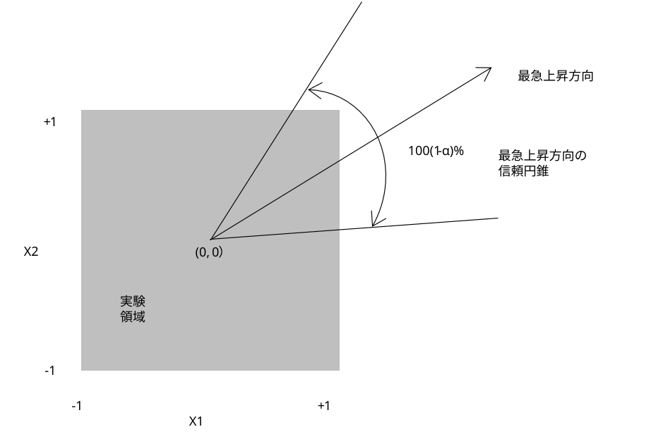

[原文 (Original English)](https://www.itl.nist.gov/div898/handbook/pri/section5/pri5312.htm)  
閲覧(UTC)：2026-08-09 15:53:36  
[⬅️](pri5311.md)[➡️](pri5313.md)  

5. [工程の改善](../pri.md)  
5.5. [応用題目](pri5.md)  
5.5.3. [工程最適化方法](pri53.md)  
5.5.3.1. [単応答の場合](pri531.md)  

---

# 5.5.3.1.2. 単応答：検索経路の信頼領域

#### 最急上昇方向は推定値に過ぎず、方向推定値の周囲に信頼「円錐」を構築可能であることを意味する「無作為性」
勾配 ***g*' = (*b*0, *b*2, ...,*b**k*)**によって示される方向は、**N** 回実行の標本に基づく単一（点）推定値に過ぎない。
もし別の **N** 回実行集合が実施された場合、それらは異なる母数推定値を与え、ひいては異なる勾配となる。
この標本抽出のばらつきを考慮するために、[Box と Draper](../section8/pri8.md#BoxDra)は、最大勾配の方向の周囲に $`(\beta_{1}, \beta_{2}, \ldots , \beta_{k})`$ で与えられる真の（未知の）系の勾配を一定の確率で包含する「円錐」を構築するための式を提示した。
信頼円錐の幅は推定された探索方向がどの程度信頼できるかを評価するのに有用である。

図5.4 は、2要因実験における最大上昇方向の円錐を示している。
もし円錐が広すぎて、ほぼすべての可能な方向が円錐内に含まれてしまう場合、実験者は、最大上昇または最大下降の経路に沿って、現在の運転条件から過度に離れることには細心の注意を払うべきである。
通常、これは線形適合の精度がかなり低い場合（すなわち、R2値が低い場合）に発生する。
したがって、信頼円錐をプロットすること自体は、その幅を計算することほど重要ではない。

このような円錐（およびその幅）の計算方法の詳細は、[技術付録 5B](pri5312.md#Technical Appendix)を参照のこと。 

#### 最も急な登り方向の信頼円錐のグラフ

{: .text-center}

**図5.4：2要因の実験における最も急な上昇方向の信頼円錐**
{: .text-center}

---

**技術付録 5B：最急上昇方向の信頼円錐の計算**

#### 最大勾配方向に対する信頼円錐の構築方法詳細
対象とする応答が、1次多項式モデルによって適切に記述できるとする。
次の不等式

$$\sum_{i=1}^k {b_i^2} -\frac{ \left( \sum_{i=1}^k{b_i x_i} \right) ^2}{\sum_{i=1}^k x_i^2} \le (k - 1)s_b^2 F_{\alpha,k-1,n-p}$$ 

ここで、

$$s_{b}^{2} = SS_{\text{error}} \frac{C_{jj}}{n - p}$$

$`C_{jj}`$ は行列 **(*X'X*)****-1** の *j* 番目の対角要素であり（$`j = 1,\ldots, k`$ について、実験計画法が少なくとも解像度 Ⅲ の 2k-p 要因計画であるならばこれらの値はすべて等しくなる）であり、***X*** は実験モデル行列である（もしあれば切片および2次項列を含む）。
座標 ***x*' = (*x*1, *x*2, ...,*x**k*)** を持つ任意の操作条件で、この不等式を満たすものは、次式ならば 100(1 - *α*)% の最急上昇信頼円錐内に位置する方向を生成し、

$$\sum_{i=1}^{k}{b_i x_i} > 0$$

次式の場合は、100(1 - *α*)% 最急下降信頼円錐内となる。

$$\sum_{i=1}^k {b_i x_i} < 0$$ 

#### 円錐を定義する不等式
この[不等式](pri5312.md#Eq3)は、頂点を原点に持ち、中心線が $`\hat{Y}`$ の勾配に沿って位置する円錐を定義する。

#### 適合度の指標：$`\theta_{\alpha}`$
探索方向の「良さ」の尺度として、最急上昇／下降方向を取り囲む 100(1 - *α*)% の信頼円錐に拠る<u>除外</u>方向の割合が用いられ（[Box and Draper, 1987](../section8/pri8.md#BoxDra)参照）、次式で与えられる。

$$\begin{array}{lcl}
\theta_{\alpha} & = & 1 - \phi_{\alpha} \\
& = & 1 - T_{k-1}\left(\frac{\sum_{i=1}^{k}{b_{i}^{2}}}{s_{b}^{2}F_{\alpha,k-1,n-p}} - (k - 1)\right) ^{1/2}
\end{array}$$

ここで、$`T_{k-1}()`$ は自由度 *k*-1 のスチューデントの t 分布関数の補関数を表す（すなわち、$`T_{k-1}(x) = P(t_{k-1} \geq x))`$ また、$`F_{\alph,k-1,n-p}`$ は、自由度が *k*-1 および *n*-*p* の *F* 分布の *α* % 点を表し、ここで *n*-*p* は誤差の自由度を表す。
$`\theta_{\alpha}`$ 値は、信頼円錐に含まれる方向の割合を表す。
$`\theta_{\alpha}`$ が小さいほど円錐は広くなり、$`0 \le \theta_{\alpha} \le 1`$ となる。
なお、[不等式](pri5312.md#Eq3)および[「良好さ指標」式](pri5312.md#eq4)は、操作条件が符号付き単位で与えられている場合に有効である。

**例：$`\theta_{\alpha}`$ の計算**

#### ANOVAの表と *C*jj から $`s_{b}^{2}`$ の計算
[前述](pri5311.md)の化学実験の ANOVA表から **2****2**要因の場合、$`C_{jj} = 1/4 \quad (j=2,3`$）であることから次式となる。

$$s_b^2 = \frac{1}{4} (52.4579) = 13.1145$$

最大勾配方向における 95％信頼錐によって除外される方向の割合は、次の通り。

#### \( \theta_{\alpha} \) の計算
$$\begin{array}{lcl}
\theta_{0.05} & = & 1 - T_{1} \left[\frac{(-1.2925)^{2} + (11.14)^{2}} {(13.1145)(5.99)} - 1 \right] ^{0.5} \\
& = & 1 - 0.29 \\
& = & 0.71
\end{array}$$

#### この例に関する結論
$`F_{0.05,1,6} = 5.99`$ から、現在の動作点から考えられる方向の 71% が、95%信頼度で除外される。
これは、ステップ長を選択する際に活用できる有用な情報である。
$`\theta_{\alpha}`$が小さいほど、最急上昇方向の信頼性が低くなるため、ステップ長は短くすべきである。
この例では、高い信頼度をもって、真の最急上昇方向は、全方向の 29％を占めるこの円錐の範囲内にある。
*k*=2 のとき、360° の 29％ = 104.4° となり、推定された最急上昇経路が 95％信頼で、真の最急経路の ±52.2° の範囲内にある。
この場合、推定された最急上昇経路に沿って大きなステップを設定すべきではない。

---
#### 訳註  
* 図は翻訳しています。